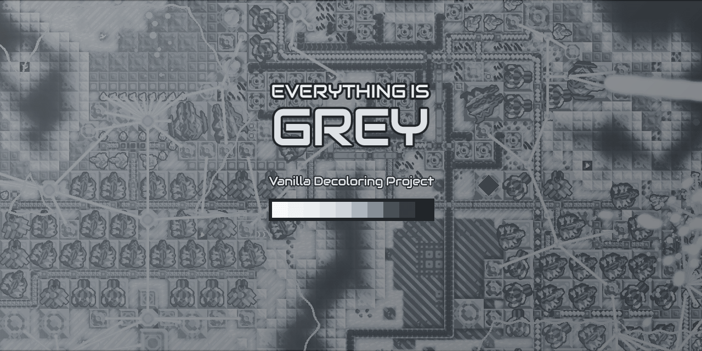

# EVERYTHING IS GREY
## Yet another vanilla sprites decoloring project

This is my first mod. I wanted to mess around with limited and specific greyscale. It should cause no issues and work with any version of Mindustry but to use this mod is to use it at your own risk, etc.

### WIP

Report any issues to NEW GIRLFRIEND#1955
